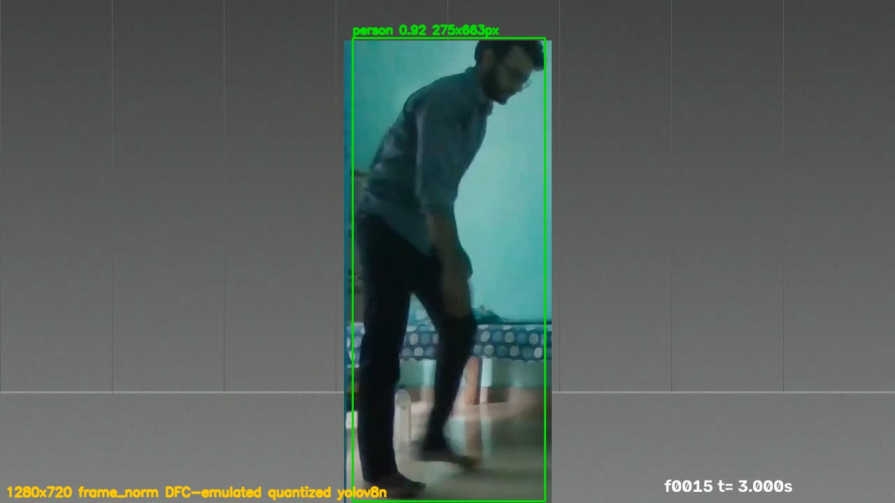
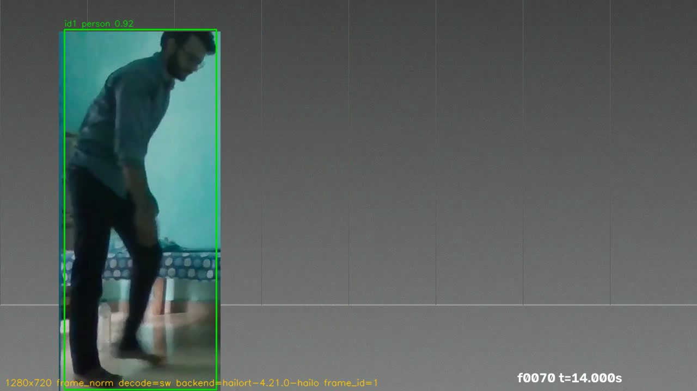

# Hailo-8 / 8L detector (Raspberry Pi 5)

RTSP → FFmpeg decode → YOLOv8n on the Hailo NPU → `sensecraft.detection/1` on
MQTT. Same contract, same tracker, same `frame_norm` publishing path as
`platforms/generic` and `platforms/rknn`; the platform-specific parts are the
HEF build and the head decode.

**Status: measured on the reference board.** See "Measured on a Raspberry Pi 5
+ Hailo-8" below; every number there came off that run.

## What is platform-specific

| Concern | This platform |
|---|---|
| Accelerator | Hailo-8 (26 TOPS) or Hailo-8L (13 TOPS) over PCIe, `/dev/hailo0` |
| Model | `models/yolov8n.hef`, built from the repo's shared `yolov8n.onnx` — see `models/README.md` |
| Preprocess | letterbox to 640×640, uint8 NHWC RGB; the `/255` is folded into the HEF input layer |
| Head decode | six-output split head decoded in NumPy (`esk_hailo/hailo_yolo.py`) |
| `health.decode` | `sw`, and `fallback_active: false` — see below |
| `health.backend` | `hailort-<version>-<arch>`, e.g. `hailort-4.21.0-hailo8` |

### Decode is `sw`, and that is the honest answer

The Raspberry Pi 5 removed the H.264 hardware decoder the Pi 4 had; VideoCore
VII decodes HEVC only. An H.264 RTSP stream is therefore decoded by FFmpeg on
the Cortex-A76 cores, and there is no hardware path being silently missed.

So this platform reports `decode: sw` with `fallback_active: false`, and
`config.example.yaml` has no `require_hw_decode` switch — unlike the Rockchip
platform, where a silent drop from MPP to CPU is the characteristic failure and
the detector refuses to start on the fallback. Reporting `hw` here to make the
fleet page look uniform would be a lie about where the cycles go, and the field
exists precisely so an operator can see that.

### The head is cut at the six convolutions

The HEF ends at the detection head's convolutions; DFL, the box assembly and
NMS run in NumPy on the host. That is the same split `platforms/rknn` uses for
the model-zoo export, and `esk_hailo/hailo_yolo.py` is a port of that decoder —
same DFL mean, same anchor centres, same greedy NMS — so a coordinate bug
cannot hide on one platform while the other looks fine.

Two Hailo-specific details:

* The class branch carries an on-chip sigmoid (`change_output_activation`), so
  the values thresholded are probabilities. `HailoPersonDetector` checks that
  range on its first inference and raises if the HEF was built without it,
  because logits published as `score` would still look plausible and would put
  every threshold in the stack quietly off.
* Branches are paired **by tensor shape**, never by output name or order.
  HailoRT keys outputs by graph layer name (`yolov8n/conv41` …) and those names
  change on every re-translation, so a name-dependent decoder would break
  silently at the next recompile.

## Install on the board

HailoRT's 4.x ioctl protocol is not forward compatible: the kernel driver, the
userspace library and the Python bindings must be the same major.minor. The
reference board runs `hailort 4.21.0` and `hailort-pcie-driver 4.21.0`, both
`apt-mark hold`ed, so the bindings are installed from the matching 4.21.0
wheel rather than resolved from an index. (The PyPI project named `hailort` is
an unrelated stub.)

Raspberry Pi OS ships Python 3.13 and Hailo publishes no cp313 wheel for
4.21.0, so the venv is pinned to 3.11 — `uv` fetches the interpreter, which is
lighter than the Docker route and matters on a board with 2.6 GB free:

```bash
uv venv --python 3.11 .venv
uv pip install --python .venv/bin/python \
  numpy 'opencv-python-headless>=4.9' 'paho-mqtt>=1.6,<2.0' 'pyyaml>=6.0' \
  ./hailort-4.21.0-cp311-cp311-linux_aarch64.whl
```

The Pi 5 also needs `force_desc_page_size=4096` on the `hailo_pci` module —
the kernel's 16 KB pages exceed the Hailo-8 PCIe descriptor limit and HEF
configuration fails while `fw-control identify` still succeeds:

```bash
echo "options hailo_pci force_desc_page_size=4096" | sudo tee /etc/modprobe.d/hailo.conf
```

Check the HEF loads and its shapes are what the decoder expects, without
starting the pipeline:

```bash
.venv/bin/python -m esk_hailo --config config.yaml --validate
```

## Run

```bash
.venv/bin/python -m esk_hailo --config config.yaml
.venv/bin/python -m esk_hailo --config config.yaml --seconds 60 --annotate evidence.jpg
```

`--annotate` draws boxes reconstructed from the **published** `frame_norm`
values, not from internal pixel boxes, so a wrong letterbox inverse shows up as
squashed or offset rectangles instead of as a plausible number.

## Tests

Host-only, no NPU and no HEF needed:

```bash
uv run pytest        # 37 passed
```

`test_decode_head.py` plants one-hot DFL distributions into a synthetic head,
so the expected box is analytic and the test does not re-implement the softmax
it is checking. It pins branch pairing, stride derivation, the DFL sign
convention, output-order independence and the letterbox inverse on a 16:9
source. `test_fixtures_schema.py` validated 3 captured payloads from the
hardware run; it skipped, and the count was 25 passed / 4 skipped, until
`fixtures/` was populated on 2026-08-20.

## Correctness evidence before the hardware run

The quantized graph was run in the Dataflow Compiler's emulator against real
1280×720 frames and decoded by the committed `esk_hailo` code. This exercises
the head decode, the letterbox inverse and the `frame_norm` conversion with the
exact weights baked into the HEF. **It is not a hardware run and says nothing
about latency**; it is kept because it is what the geometry was checked against
before the NPU was available, and the board run below agrees with it.



| Frame | Truth `cx` | Published `cx` | Published `w × h` |
|---|---|---|---|
| `truth.mp4` t = 3.0 s (frame 15) | 0.50039 | 0.500933 | 0.2151 × 0.9212 |
| `truth.mp4` t = 16.0 s (frame 80) | 0.20039 | 0.201799 | 0.2168 × 0.9214 |
| ADL clip t = 12.0 s | — | 0.35053 | 0.1774 × 0.6425 |

The truth clip translates a 297 × 662 px person patch along a schedule defined
in seconds, so the expected centroid is known before anything runs. The
published centres land 0.7 px and 1.8 px from it, and the box height (0.921 of
720 px = 663 px) matches the patch to a pixel. On a 1280×720 source the
letterbox pads 140 px top and bottom; an inverse that ignored the pad or
divided x and y by different factors could not produce those numbers.

## Measured on a Raspberry Pi 5 + Hailo-8 (HailoRT 4.21.0, 1280×720 H.264 @ 5 fps)

Raspberry Pi OS, kernel 16 KB pages, `hailo_pci force_desc_page_size=4096`,
`hailort` and `hailort-pcie-driver` both 4.21.0 and `apt-mark hold`ed, firmware
4.21.0 on a Hailo-8 at `0001:01:00.0`. Broker, hub, RTSP server and detector all
on the board, so network jitter cannot be read as detector latency. The board was
*not* quiesced: ten unrelated containers kept running throughout and only the one
holding `/dev/hailo0` was stopped for the duration.

The HEF is the artifact `models/README.md` pins — `sha256 dbabd55f…e501475`,
verified on the board after transfer.

### The device is reachable, and `fw-control identify` is not the check

With the incumbent stopped, `hailortcli run` is the check that settles it:

```
$ hailortcli run models/yolov8n.hef -t 5
Running streaming inference (models/yolov8n.hef):
  Transform data: true
    Type:      auto
    Quantized: true
> Inference result:
 Network group: yolov8n
    Frames count: 1597
    FPS: 319.01
    Send Rate: 3136.01 Mbit/s
    Recv Rate: 3087.01 Mbit/s
```

319 fps back-to-back on an otherwise idle NPU. That is a benchmark loop, not a
per-frame cost in this pipeline — see the latency table below, where the same
inference call takes 9.7 ms (103 fps equivalent) at 5 fps.

`--validate` reports the shapes the decoder expects, from the real device:

```
model OK: .../models/yolov8n.hef backend=hailort-4.21.0-hailo
input yolov8n/input_layer1 (640, 640, 3)
output yolov8n/conv41 (80, 80, 64)
output yolov8n/conv42 (80, 80, 80)
output yolov8n/conv52 (40, 40, 64)
output yolov8n/conv53 (40, 40, 80)
output yolov8n/conv62 (20, 20, 64)
output yolov8n/conv63 (20, 20, 80)
```

### Latency, CPU and memory

Three windows on the running stack — the 130 s acceptance run, a 40 s
`--annotate` run and a 30 s run:

| | 130 s run | 40 s run | 30 s run |
|---|---:|---:|---:|
| `inference_time_ms` p50 / p95 | 9.7 / 10.8 | 9.81 / 10.74 | 9.68 / 10.91 |
| `pipeline_ms` p50 / p95 | 17.4 / 19.2 | 16.07 / 19.71 | 15.79 / 19.40 |
| sustained fps | 5.00 (source-limited) | 5.00 | 5.00 |

`pipeline_ms` starts after `capture.read()`, the same point `platforms/rknn`
measures from, so the two are comparable and neither includes RTSP decode.

Detector CPU sampled from `/proc/<pid>/stat` deltas over 60 s, one core:
**8.7 – 13.0 %, median 11.7 %**. RSS **127 – 131 MB**.

A note for anyone re-measuring RSS on this board: the kernel runs 16 KB pages, so
`statm` resident must be multiplied by 16384, not 4096. Assuming 4 KB reports
32 MB — a quarter of the truth — and `ps rss` (131040 kB) is what settles it.

NPU occupancy was not sampled: `hailortcli monitor` needs
`HAILO_MONITOR=1` exported in the *measured* process before it starts, and the
run was not launched with it. Absent, not estimated.

### End to end, against the truth video

`tools/rtsp-fixture/verify_e2e.py`, 130 s, `ESK_SKIP_ADL=1`, hub and broker on
the board, truth clip published at 5 fps on `rtsp://127.0.0.1:8557/edge-sec-truth`:

```
== FAILURES
  FAIL zone_enter alert 1 (track 1): no truth entry within 0.5s (nearest -30.800s)
```

| assertion | tolerance | measured |
|---|---|---|
| `line_cross` forward instants (×4) | ±0.5 s | 0.0062 – 0.0064 s |
| `line_cross` backward instants (×4) | ±0.5 s | 0.1831 – 0.1888 s |
| direction correctness | 8/8 | 8/8 |
| forward-only line fired on a backward crossing | never | **NONE** |
| backward-only line fired on a forward crossing | never | **NONE** |
| `zone_enter` instants (×4) | ±0.5 s | 0.001 s |
| `loitering` dwell error | ≤1 s | 0.004 – 0.2 s |
| snapshots | real JPEG | 8/8, `image/jpeg`, 50.4 – 52.7 KB |

Capture-to-alert p50 **23.8 ms**, p95 **206.2 ms**.

The one complaint is alert `1`: a `zone_enter` fired at rule install, because the
subject was already inside the zone when the rules were PUT and the first frame
the hub judged was therefore an entry. Its nearest truth instant is 30.8 s away —
one clip period — so it is the leading artefact the RK3588, RK3576 and Jetson
READMEs describe, not a coordinate or timing error. Every one of the 32 alerts
that follows it pairs with a truth instant. The line was left at `x = 0.5`
(no `ESK_LINE_X` nudge): decode is software at full 1280×720 here, so a published
`cx` is not quantized to the 1/640 grid that puts a mid-frame line on `side == 0`
for the RK platforms.

### Evidence frame



Drawn from the published `frame_norm` values on the board, not by the emulator.
The box height (0.9199 of 720 px = 662 px) matches the 662 px person patch, which
a letterbox inverse that ignored the 140 px pad could not produce.

### Captured payloads

`fixtures/` now holds detection, status and status-LWT taken off the broker
during this run; `tests/test_fixtures_schema.py` no longer skips.

```
$ .venv/bin/python -m pytest -q
37 passed in 0.52s
```

### Host-side decode, measured four ways

Three host-side optimizations ship on by default, selectable with
`ESK_HAILO_OPTS` so one build and one HEF produce the whole comparison:
`""` baseline, `"a"`, `"ab"`, `"abc"` (default).

* **A** — outputs are `UINT8` and the person channel is thresholded in the
  quantized domain. `decode_split_head` only ever reads that channel to
  threshold and the surviving anchors' box distribution, so `FLOAT32` had
  HailoRT convert 1 209 600 elements on the host to use roughly ten thousand.
* **B** — `create_bindings()` and the output buffers move to `__init__`.
* **C** — letterbox writes into a preallocated canvas, with the BGR→RGB swap
  in place.

Local video source at full speed, 15 s windows after a 5 s warmup, one fresh
process per window, run in the order `"" → a → ab → abc` three times over.
Interleaved rather than tier-by-tier, so drift on a board carrying ten other
containers cannot be read as a gain:

| tier | fps, median [range] | `pipeline_ms` p50 | vs baseline |
|---|---|---:|---:|
| `""` | 55.41 [55.32, 55.62] | 14.93 | — |
| `"a"` | 62.30 [62.03, 62.51] | 13.10 | +12.4% |
| `"ab"` | 63.04 [51.89, 63.32] | 12.90 | +13.8% |
| `"abc"` | 84.57 [84.08, 84.79] | 8.83 | **+52.6%** |

**C carries most of it, which is not what counting elements predicts.** A
removes 1.2 M element conversions and buys 12%; C removes two allocations and
one copy and buys 34% on top of A+B. The copy it removes is
`np.ascontiguousarray(padded[:, :, ::-1])` — a negative-stride reverse on the
last axis, so its cost per element is far above a sequential convert. Element
count is not a proxy for time.

B's own contribution is inside the noise: one of its three windows came in at
51.89 fps against 63.04 and 63.32. That window is why the runs interleave.

`inference_time_ms` p50 reads 9.07 at baseline and ~7.4 at every other tier.
**The metric's coverage changes at A** — dequantization moves out of
`configured.run()` and into decode — so the baseline figure is not comparable
to the other three. That the other three are flat is the useful reading: none
of these optimizations touches the accelerator call.

The uint8 path was gated before it was timed. 155 frames of `truth.mp4`
through `""` and `"a"`, same build, same HEF, same frame order, canvas reuse
off in both so preprocessing is byte-identical: 155/155 frames carry a
detection, zero box-count mismatches, and **max coordinate delta and max score
delta are both exactly 0**. HailoRT's `FLOAT32` output equals
`(q - qp_zp) * qp_scale` bit-for-bit on this hardware. The clip carries one
person, so this covers the dequantization arithmetic and the threshold
boundary but not multi-box NMS ordering under the uint8 path.

### One defect found: the process segfaults on exit

Every mode exits with **139** — `--validate`, `--seconds N`, the annotate run —
after printing its full result and after all work is done:

```
2026-08-20 20:53:06,721 INFO esk.hailo published 142 detection messages, 5.00 fps,
  inference p50=9.68ms p95=10.91ms, pipeline p50=15.79ms p95=19.40ms
Segmentation fault
run rc=139
```

No payload, measurement or file is affected — the crash is in HailoRT teardown at
interpreter exit, past the last publish. It matters anyway: a supervisor
(systemd, Docker restart policy) reads 139 as a crash, so a clean shutdown is
indistinguishable from a failure, and `contracts/MQTT.md`'s clean-exit path (a
retained `online: false` written on DISCONNECT rather than via the LWT) cannot be
relied on.

**Fixed in `dbc42ef`.** `close()` released the `VDevice` while `self.configured`
and `self.infer_model` still held pybind11 handles into it, so both destructors
ran at interpreter exit against a freed device. Dropping the two wrappers first,
then releasing, makes their destructors run while the device is still alive.

Confirmed on the board with a negative control — without one, an exit code of 0
only shows that *something* changed, not that this change caused it:

| mode | fixed | `close()` reverted to the old order |
|---|---|---|
| `--validate` | rc=0 (twice) | rc=139 |
| `--seconds N` | rc=0 (twice) | rc=135 |

The old order gives **135 (SIGBUS) on `--seconds` and 139 (SIGSEGV) on
`--validate`** — the same defect, but not even a consistent bad exit code, which
is worse for a supervisor than a single reliable one. The reverted build's
stdout was also lost on the first attempt: the fault killed the process before
the block-buffered pipe flushed, so the run has to be repeated unbuffered to see
that the work had in fact completed.
